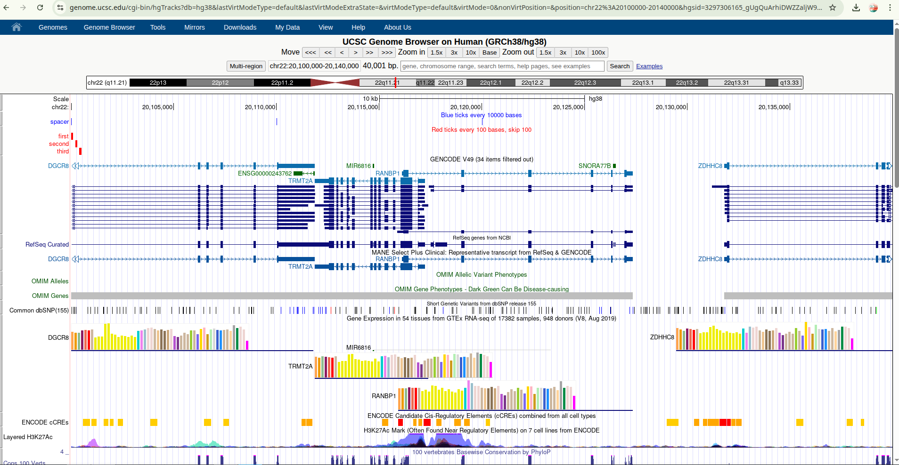

# 🧬 UCSC Genome Browser — Custom Track Visualization Tutorial

[](LICENSE)
[](https://mtariqi.github.io/ucsc-genome-browser-tutorial/)
[](https://github.com/mtariqi)

---

### 📘 Overview
This repository provides a **hands-on tutorial** on visualizing custom genomic data using the **UCSC Genome Browser**.  
You’ll learn to upload BED files, display custom annotations, and generate **shareable URLs or sessions** for collaborative analysis.  
Ideal for **bioinformatics students**, **educators**, and **researchers** focusing on reproducible genome visualization.

---
# 🧬 UCSC Genome Browser Custom Track Report

**Author:** Md Tariqul Islam (Tariq)  
**Institution:** Northeastern University – Bioinformatics Program  
**Contact:** tariqul@scired.com  
**Date:** November 2025  

---

## 🎯 Objective
The goal of this activity was to explore the **UCSC Genome Browser** and visualize **custom genomic tracks** using a BED file.  
This hands-on exercise demonstrates how to integrate personal data with reference genome annotations, manage browser sessions, and generate shareable visualization links.

---

## 🧪 Steps Performed

### 1. Launching the UCSC Genome Browser
- Navigated to [UCSC Genome Browser Gateway](https://genome.ucsc.edu/cgi-bin/hgGateway)  
- Selected assembly **Human (GRCh38/hg38)**  
- Specified genomic region:  


### 2. Adding Custom Tracks
- Clicked **“Add custom tracks”**
- Uploaded `test.bed` containing two tracks:
- **Spacer** (Blue ticks every 10,000 bases)
- **Even** (Red ticks every 100 bases, skipping 100)
- Confirmed successful parsing of the BED file
- Clicked **“Go to Genome Browser”** to visualize the tracks

### 3. Visual Confirmation
- Both custom tracks appeared correctly aligned with genomic features:
- **Spacer track** (Blue): evenly spaced intervals  
- **Even track** (Red): closely packed smaller markers
- Verified alignment with **RefSeq**, **GENCODE**, and **OMIM** annotations.



---

## 💡 Reflection

This exercise provided valuable insight into how genomic data visualization enhances understanding of **genome structure and annotations**.  
I learned how to:
- Upload and visualize personal data alongside public tracks  
- Modify visualization modes (hide/dense/pack/full)  
- Generate **session URLs** for reproducible sharing  
- Understand how BED file formatting impacts display output  

This activity bridges theory and practice by demonstrating how bioinformatics workflows integrate data exploration and visualization.

---

## 📊 Key Results

| Track Name | Color | Description | Region |
|-------------|--------|--------------|---------|
| spacer | Blue (0,0,255) | Ticks every 10kb | chr22:20,100,000–20,140,000 |
| even | Red (255,0,0) | Ticks every 100bp | chr22:20,100,000–20,140,000 |

---

## 🔗 References
- UCSC Genome Browser: https://genome.ucsc.edu/  
- Custom Track Help: https://genome.ucsc.edu/goldenPath/help/customTrack.html  
- Sharing Sessions & URLs: https://genome-blog.gi.ucsc.edu/blog/2021/08/13/sharing-data-with-sessions-and-urls/  
- BED Format Specification: https://genome.ucsc.edu/FAQ/FAQformat.html#format1  

---

**Repository:** [mtariqi/ucsc-genome-browser-tutorial](https://github.com/mtariqi/ucsc-genome-browser-tutorial)  
**License:** MIT License  

---


## 📁 Repository Structure

```
ucsc-genome-browser-tutorial/
│
├── README.md                          # Main tutorial guide (this file)
├── test.bed                           # Sample BED file (custom tracks)
│
├── data/                              # Example BED data
│   ├── test.bed
│   └── examples/
│       ├── example_simple.bed
│       ├── example_colored.bed
│       └── example_genes.bed
│
├── screenshots/                       # Step-by-step visual aids
│   ├── 01_gateway.png
│   ├── 02_add_custom_tracks.png
│   ├── 03_upload_file.png
│   ├── 04_track_display.png
│   ├── 05_my_sessions.png
│   ├── 06_save_session.png
│   └── 07_share_link.png
│
├── docs/                              # Extended documentation
│   ├── bed_format_guide.md
│   ├── troubleshooting.md
│   ├── advanced_features.md
│   └── faq.md
│
├── scripts/                           # Utility scripts for BED operations
│   ├── validate_bed.py
│   ├── convert_coordinates.py
│   ├── generate_bed.py
│   └── README.md
│
├── examples/                          # Practical workflows
│   ├── basic_workflow/
│   ├── multiple_tracks/
│   └── annotation_project/
│
├── templates/                         # BED templates for reuse
│   ├── template_basic.bed
│   ├── template_scored.bed
│   ├── template_colored.bed
│   └── README.md
│
├── .gitignore
├── LICENSE
└── CONTRIBUTING.md
```

🧩 Key Components

| Folder             | Description                                                                  |
| ------------------ | ---------------------------------------------------------------------------- |
| **`data/`**        | Example BED files used in the tutorial                                       |
| **`screenshots/`** | Visual walkthrough of the UCSC Genome Browser interface                      |
| **`docs/`**        | Extended documentation on BED format, advanced features, and troubleshooting |
| **`scripts/`**     | Python tools to validate, convert, and generate BED files                    |
| **`examples/`**    | End-to-end workflows demonstrating track visualization                       |
| **`templates/`**   | Ready-to-edit templates for new track creation                               |


⚡ Quick Start (Assignment Mode)

If your goal is to complete the assignment quickly, clone or download only:
```
ucsc-tutorial/
├── README.md
└── test.bed
```

About the Sample Data

The provided test.bed file contains two example custom tracks:

| Track    | Color                  | Description                               |
| -------- | ---------------------- | ----------------------------------------- |
| `spacer` | 🔵 Blue (RGB: 0,0,255) | 10 kb intervals, simple reference markers |
| `even`   | 🔴 Red (RGB: 255,0,0)  | 100 bp intervals with labeled regions     |


Coordinates cover the region:
chr22:20,100,000–20,140,000 (hg38)

Step-by-Step Tutorial
Step 1️⃣ — Access the UCSC Genome Browser

Go to the UCSC Genome Browser Gateway

Choose assembly: Human (GRCh38/hg38)

Enter region: chr22:20,100,000-20,140,000

Step 2️⃣ — Add Custom Track
Method A: Upload File

Click “add custom tracks”

Choose test.bed and click Submit

Click “Go to Genome Browser” to view your data

Method B: Paste Data

Copy all contents of test.bed

Paste into the text box under “Manage Custom Tracks”

Click Submit → Go to Genome Browser

Step 3️⃣ — Verify Track Display

Confirm two tracks appear:

Blue “spacer” markers

Red “even” tick marks with labels

If missing:

Adjust visibility (right-click → “Full” or “Dense”)

Confirm region: chr22:20,100,000-20,140,000

Verify assembly (hg38)

Step 4️⃣ — Create a Shareable Session Link (Recommended)

Go to My Data → My Sessions

Click Save Settings → Name your session

Enable “allow this session to be loaded by others”

Click Submit → Copy your permanent link

Example session link:
https://genome.ucsc.edu/s/username/sessionname

Step 5️⃣ — Validate Your Link

Open a private/incognito window and ensure:

Correct genomic region loads

Both tracks appear

Track colors and labels match

🧾 Understanding the BED Format

Structure:

track name=TrackName description="Description" color=R,G,B
chr  start  end  [optional_label]

Example:

track name=spacer description="Blue ticks every 10kb" color=0,0,255
chr22   20100000 20100001
chr22   20110000 20110001
chr22   20120000 20120001

📘 BED Rules

0-based, half-open intervals

RGB color (0–255 scale)

Optional feature labels for clarity

First line defines visual track properties


Shareable URLs vs Sessions

| Method          | Advantages                                          | Limitations                 |
| --------------- | --------------------------------------------------- | --------------------------- |
| **Sessions**    | Short, persistent URLs; user-friendly; reproducible | Requires login              |
| **Direct URLs** | Quick, no account required                          | Long and sometimes unstable |


🧭 Troubleshooting Guide


| Issue              | Possible Cause     | Solution                      |
| ------------------ | ------------------ | ----------------------------- |
| Track not visible  | Hidden by default  | Set to **“Full”** mode        |
| Wrong coordinates  | Assembly mismatch  | Ensure hg38/hg19 match        |
| Session won’t load | Session not public | Enable “allow others to load” |
| Color not showing  | Missing track line | Check `track color=` syntax   |

Additional Resources

UCSC Custom Track Documentation

BED Format Reference

UCSC Session & URL Sharing

FAQ: Linking to UCSC Browser


🧩 Educational Use

This repository is part of the Bioinformatics Visualization Module at Northeastern University, designed to teach:

Data interoperability between formats (BED, GFF, bigBed)

Reproducible visualization workflows

Collaborative annotation using browser sessions

🧪 License

This tutorial and datasets are distributed under the MIT License

Use freely for academic and educational purposes.


🤝 Contributing

Contributions are welcome!
If you’d like to add new examples, improve documentation, or submit a fix, please open a Pull Request.

📬 Contact

Author: Md Tariqul Islam (Tariq)
📧 tariqul@scired.com

🔗 GitHub Profile

🏛️ Northeastern University – Bioinformatics Program

<div align="center">

✨ Happy Genome Exploring! ✨
Built with 💙 and open science for the research community.

</div> ```


